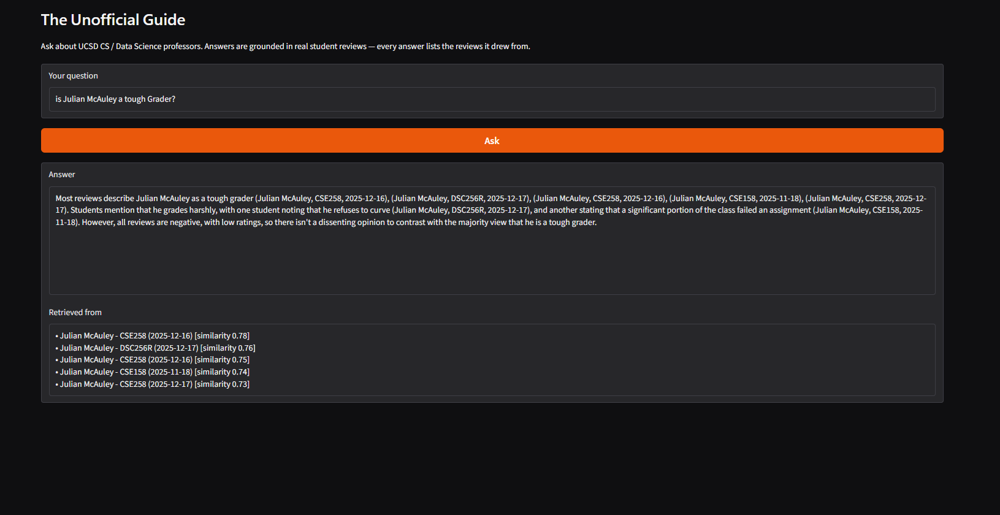

# The Unofficial Guide — Project 1

A Retrieval-Augmented Generation (RAG) system that answers plain-language questions about UCSD data science / CS professors using real student reviews. A user asks something like *"Is Julian McAuley a tough grader?"* and gets a grounded, cited answer drawn from the reviews I collected.

**Pipeline:** `scrape_reviews.py` → `ingest.py` → `embed.py` → `retrieve.py` → `generate.py` → `app.py` (Gradio UI).

---

## Setup & Usage

**Prerequisites:** Python 3.11 and a free [Groq API key](https://console.groq.com).

**1. Create the environment and install dependencies**:
```powershell
python -m venv .venv
source .venv/bin/activate            # Mac/Linux
source .venv/Scripts/activate        # Windows (Git Bash)
# or: .venv\Scripts\activate         # Windows (Command Prompt)
pip install -r requirements.txt
```

**2. Add your Groq API key** — Create a `.env` and set the key:
```
GROQ_API_KEY=your_key_here
```

**3. Build the vector store** (one-time; `embed.py` downloads the embedding model on first run):
```powershell
python ingest.py 
python embed.py    
```

**4. Ask questions**:
```powershell
python app.py                                   # web simple web UI with Gradio
python generate.py "your question here"         # one-shot answer in the terminal
python test_retrieval.py                        # retrieval-only sanity check (no LLM)
```

> The review corpus in `documents/` is already collected. To re-scrape or change which professors are included, edit the `PROFESSORS` list in `scrape_reviews.py` and run `python scrape_reviews.py`, then re-run steps 3–4.

### Preview



---

## Domain

Student reviews of professors at UCSD in the Halıcıoğlu Data Science Institute. This knowledge is valuable because finding a professor who fits your learning style or just knowing whether a professor is good matters a lot for student success. Official course catalogs don't capture teaching style, grading harshness, or workload. It's hard to find through official channels because individual student experiences vary widely; the value is in the consensus across many reviews, which no single official source provides.

---

## Document Sources

All documents are student reviews scraped from Rate My Professors (one `.txt` file per professor, paraphrasing avoided the reviews are stored as collected). 211 reviews total across 10 professors.

| # | Source | Type | URL or file path |
|---|--------|------|-----------------|
| 1 | Rate My Professors — Rose Yu | Student reviews (7) | `documents/rose_yu.txt` |
| 2 | Rate My Professors — Brad Voytek | Student reviews (22) | `documents/brad_voytek.txt` |
| 3 | Rate My Professors — Arun Kumar | Student reviews (4) | `documents/arun_kumar.txt` |
| 4 | Rate My Professors — Soohyun Liao | Student reviews (55) | `documents/soohyun_liao.txt` |
| 5 | Rate My Professors — Justin Eldridge | Student reviews (27) | `documents/justin_eldridge.txt` |
| 6 | Rate My Professors — Rajesh Gupta | Student reviews (9) | `documents/rajesh_gupta.txt` |
| 7 | Rate My Professors — Julian McAuley | Student reviews (60) | `documents/julian_mcauley.txt` |
| 8 | Rate My Professors — Gal Mishne | Student reviews (5) | `documents/gal_mishne.txt` |
| 9 | Rate My Professors — Jingbo Shang | Student reviews (16) | `documents/jingbo_shang.txt` |
| 10 | Rate My Professors — Vineet Bafna | Student reviews (6) | `documents/vineet_bafna.txt` |

---

## Chunking Strategy

**Chunk size:** One review per chunk (record-based, not a fixed character width). Chunks are variable length the embedded text runs roughly 56–459 characters (~14–115 tokens).

**Overlap:** 0.

**Why these choices fit your documents:** The documents are discrete records delimited by `---`, where each review is one student's complete opinion. Splitting on that delimiter gives exactly one review per chunk. A fixed-width or sliding-window split would be wrong: it could cut a single review in half or merge two students' opinions into one chunk, both of which hurt retrieval accuracy. Overlap exists to preserve context across arbitrary points in continuous text, but my cut points are real record boundaries, so overlap would only bleed one student's words into another's chunk. Preprocessing before chunking: I removed HTML artifacts, collapsed embedded newlines and double spaces to single spaces, and dropped the empty trailing block when a file ends in a separator. I also prepend the professor name + tags to each chunk's embedded text (see Embedding Model) but keep numeric fields out of it.

**Final chunk count:** 211 (one chunk per review, across all 10 professor files; verified to match the per-file review counts).

---

## Embedding Model

**Model used:** `multi-qa-MiniLM-L6-cos-v1` via `sentence-transformers` (384-dim, runs locally on CPU). I chose it over the general-purpose `all-MiniLM-L6-v2` because it was trained specifically for matching short natural-language questions against the corpus which fits my use case exactly (a student asks a question and it's matched against a corpus of short reviews). Vectors are stored in ChromaDB with cosine similarity, and I retrieve top-k = 5 so an answer reflects a consensus rather than a single review. I embed only the natural-language prose (professor name + tags + comment), and keep the numeric fields (rating, difficulty, course, date, aggregate stats) as metadata that is stored alongside the vector but not embedded so they would dilute the meaning vector.

**Production tradeoff reflection:** If cost weren't a constraint, I'd evaluate a higher-quality model OpenAI `text-embedding-3-small` (API-hosted) or a larger local model like `all-mpnet-base-v2` or `bge-large-en-v1.5` against my 5 eval questions to see whether they retrieve better on noisy, slang-heavy review phrasing. Context length isn't a factor here since each chunk is one short review well under any model's window. No Multilingual support; if I expanded to international student forums or non-English reviews I'd switch to `paraphrase-multilingual-MiniLM-L12-v2` or Cohere's multilingual embed. Latency/cost with only 211 chunks, local CPU inference negligible; latency and the local-vs-API tradeoff would only matter at thousands-to-millions of documents.

---

## Grounded Generation

The generator uses Groq's `llama-3.3-70b-versatile`. Retrieval is fully local (sentence-transformers + ChromaDB) and the LLM is used only for the final write-up it never influences which chunks are retrieved and only sees the 5 chunks it's handed.

**System prompt grounding instruction:** The system prompt *enforces* grounding rather than suggesting it. The actual instructions (in `generate.py`):

- Answer only from the reviews given in the context. Do not use outside knowledge or assumptions.
- If the reviews don't contain enough information to answer, say so plainly (e.g. "The available reviews don't really cover that.").
- Report the consensus AND the disagreement. When reviews conflict, say so.
- Cite your sources inline as (Professor, Course, Date).
- The prose is your primary evidence. You MAY mention a review's numeric rating or difficulty, but ONLY when it is shown in that review's context line. Never invent, average, or compute numbers that were not given to you.

Structural choices that reinforce grounding: each retrieved review is formatted into a numbered block with an explicit `cite as (Professor, Course, Date)` label plus a `rating / difficulty / tags` line, and the refusal instruction is verified to fire an off-domain question ("which dining hall has the best food?") returns "the reviews don't cover that" instead of a hallucinated answer.

**How source attribution is surfaced in the response:** Two ways. (1) The LLM cites inline as `(Professor, Course, Date)`, as instructed. (2) The source list shown in the UI / returned by `answer_question` is built programmatically from each retrieved chunk's metadata, so attribution is guaranteed even if the model forgets to cite.

---

## Evaluation Report

The 5 questions below were run through the full system (`generate.py`). Retrieval was also tested in isolation first (`test_retrieval.py`) so retrieval failures can be told apart from generation failures. The exact, verbatim system responses follow the ratings table. (The generator runs at temperature 0.2, so wording may vary slightly on re-runs; these are copied from one recorded run.)

| # | Question | Expected answer | Retrieval quality | Response accuracy |
|---|----------|-----------------|-------------------|-------------------|
| 1 | Which professor gives the most useful feedback? | Justin Eldridge (multiple "Gives good feedback" reviews); Rajesh Gupta noted for answering questions. | Partially relevant | Accurate |
| 2 | Is Julian McAuley a tough grader? | Yes — harsh grader who refuses to curve; many "Tough grader" reviews. | Relevant | Accurate |
| 3 | Which data science professor has the easiest classes? | Ambiguous in corpus — no professor is clearly "easiest". | Off-target | Partially accurate |
| 4 | Are Soohyun Liao's lectures helpful? | Mixed — some call them messy/unorganized, others clear/amazing. | Relevant | Accurate |
| 5 | Which professor should I avoid? | Lowest-rated / most negative: Soohyun Liao and Julian McAuley. | Partially relevant | Partially accurate |

**Retrieval quality:** Relevant / Partially relevant / Off-target
**Response accuracy:** Accurate / Partially accurate / Inaccurate

### System Responses

**Q1 — Which professor gives the most useful feedback?**
> Based on the available reviews, Professor Justin Eldridge is often described as giving good feedback. Multiple reviews, such as (Justin Eldridge, DSC80, 2023-01-06) and (Justin Eldridge, DSC80, 2022-01-02), specifically mention that he "Gives good feedback". Another review, (Justin Eldridge, DSC40A, 2020-02-11), also mentions this trait. In contrast, the reviews for Professor Rajesh Gupta do not explicitly mention the quality of his feedback, although (Rajesh Gupta, CSE30, 2010-03-19) does mention that he is "open minded" and willing to adapt grades if there were mistakes. However, the available reviews do not provide a direct comparison of the usefulness of feedback between the two professors. The reviews for Professor Eldridge consistently highlight his ability to give good feedback, making him the professor most explicitly associated with this trait.

**Q2 — Is Julian McAuley a tough grader?**
> Most reviews describe Julian McAuley as a tough grader, with all five reviews explicitly stating this (Julian McAuley, CSE258, 2025-12-16), (Julian McAuley, DSC256R, 2025-12-17), (Julian McAuley, CSE258, 2025-12-16), (Julian McAuley, CSE158, 2025-11-18), (Julian McAuley, CSE258, 2025-12-17). The reasons for this perception vary, including harsh grading without curving (Julian McAuley, DSC256R, 2025-12-17), significant portions of the grade based on limited assignments or peer feedback (Julian McAuley, CSE258, 2025-12-16), and an extremely hard assignment (Julian McAuley, CSE158, 2025-11-18). There is no disagreement among these reviews regarding Julian McAuley being a tough grader.

**Q3 — Which data science professor has the easiest classes?**
> Based on the available reviews, Justin Eldridge's classes are described as having a moderate difficulty level of 3.0/5 (Justin Eldridge, DSC40B, 2025-06-25), (Justin Eldridge, DSC40B, 2024-12-28), (Justin Eldridge, DSC140A, 2025-04-03). However, students consistently praise his teaching style, organization, and ability to explain complex concepts, making the classes feel manageable. One student notes that he "didn't give us an absurd amount of work" (Justin Eldridge, DSC40B, 2025-05-27), suggesting that the workload is reasonable. Overall, while the reviews don't explicitly state that his classes are the "easiest," they do suggest that Justin Eldridge's classes are well-structured and accessible, which may make them feel less challenging for students.

**Q4 — Are Soohyun Liao's lectures helpful?**
> Soohyun Liao's lectures are described as helpful by some students, with one stating that they had "good examples and opportunities for remote attendance" (Soohyun Liao, DSC30, 2025-06-12), and another noting that her lectures were "focused, clear, and slow paced" (Soohyun Liao, DSC30, 2025-09-06). However, other students disagree, with one saying that her lectures "make no sense" and are "messy and unorganized" (Soohyun Liao, DSC30, 2024-11-29), and another stating that they "may not learn as much as expected" in her lectures (Soohyun Liao, DSC30, 2022-03-12). Additionally, one student found her approach to be "inspirational" and appreciated the freedom to "search our own examples through AI" (Soohyun Liao, DSC30, 2025-06-09). Overall, the reviews suggest that opinions on the helpfulness of Soohyun Liao's lectures are divided.

**Q5 — Which professor should I avoid?**
> Based on the available reviews, Soohyun Liao (DSC30, 2025-06-13, 2025-06-05) is consistently described as a professor to avoid, with students citing issues such as a lack of care for students, unresponsiveness to emails, poor explanations, and unfair grading (Soohyun Liao, DSC30, 2025-06-13, 2025-06-05).
>
> In contrast, reviews for Rajesh Gupta are mixed: while some students praise him as a great person who is open to adapting grades and answering questions (Rajesh Gupta, CSE30, 2010-03-19), others criticize his disorganization, incomprehensible speaking style, and unhelpful lectures (Rajesh Gupta, CSE30, 2010-03-18, 2010-02-24). However, the criticisms of Professor Gupta do not seem to be as severe or consistent as those of Professor Liao.

A notable pattern: in the two weak-retrieval cases (Q3, Q5), the generation stage compensated feeding the numeric `rating`/`difficulty` into the context plus the "report consensus and refuse when uncovered" prompt kept the model honest instead of confidently wrong. Q3 still can't truly be answered.

---

## Failure Case Analysis

**Question that failed:** "Which data science professor has the easiest classes?" (Q3)

**What the system returned:** Five reviews, all for Justin Eldridge, praising his teaching and organization. The answer leaned on the `difficulty 3.0/5` metadata and honestly noted the reviews don't actually describe his classes as the "easiest," only as manageable  so it neither found the right answer nor fabricated one.

**Root cause (tied to a specific pipeline stage):** This is a **retrieval (embedding)** failure, not a generation failure. The query depends on the ifficulty dimension, but dense embeddings of review prose encode topic and sentiment. Easiest is corpus-wide while top-k = 5 only ever sees 5 reviews from one or two professors. So the retriever pulled on-topic "good data science professor" reviews (Eldridge, who is heavily and positively reviewed) instead of surveying difficulty across all 10 professors. The retrieval sanity check showed the same thing: distances were mid-range and the hits clustered on one well-reviewed professor.

**What you would change to fix it:** Use the structured metadata instead of relying on the embedding for this question type. Specifically, for difficulty/superlative questions I'd (1) compute per-professor aggregates from the `difficulty` and `avg_difficulty` metadata and rank professors directly, and (2) optionally pass that small aggregate table to the LLM alongside the retrieved reviews, so a "most/least/easiest" question is answered from real cross-professor numbers rather than a non-representative top-5 slice.

---

## Spec Reflection

**One way the spec helped you during implementation:** Deciding the chunking strategy in planning.md before writing code (split on `---`, one review per chunk, ~211 chunks) an exact target. When I ran `ingest.py` I could immediately assert the chunk count was 211 and cross-check it against the per-professor review counts in my Documents table, which caught problems early (e.g. confirming multi-line comments weren't silently dropping reviews). Writing the 5 evaluation questions up front also let me test retrieval in isolation before building generation, so I knew which weaknesses were retrieval's fault versus the LLM's.

**One way your implementation diverged from the spec, and why:** My original plan treated each chunk as the full review text (including the numeric rating/difficulty/date). During implementation I embed only the prose (professor + tags + comment) and keep the numeric fields as metadata. The reason is that numbers and field labels are noise for semantic similarity embedding "rating: 5.0, difficulty: 2.0" dilutes the meaning vector without helping match a natural-language question.

---

## AI Usage

**Instance 1 — Ingestion + the embed-vs-metadata split**

- *What I gave the AI:* My Chunking Strategy section and Documents table, and asked it to implement the ingestion/chunking (`ingest.py`) that splits each file on `---` into one chunk per review with metadata for citation.
- *What it produced:* A working chunker, but its first version put everything including the numeric `rating`/`difficulty`/`date` and the field labels into the text that gets embedded.
- *What I changed or overrode:* After figuring out how dense retrieval works, I directed it to embed only the prose (professor + tags + comment) and move all numeric fields into ChromaDB metadata that is stored but not embedded. I also had it clean HTML entities and collapse embedded newlines, which I found by inspecting the raw reviews.

**Instance 2 — Grounded generation + interface**

- *What I gave the AI:* My grounding requirement (answer only from retrieved context, refuse when uncovered), the desired output format (answer + programmatic source list), the Groq `llama-3.3-70b-versatile` choice, and a Gradio skeleton; asked it to wire `generate.py` and `app.py` together.
- *What it produced:* A generation function with a grounding system prompt and a Gradio UI matching my skeleton.
- *What I changed or overrode:* I read the generated code before running it to confirm the system prompt enforces grounding, and that the source list is assembled in Python from metadata rather than parsed from the LLM output. I then tested the refusal behavior to verify the model declines instead of using training knowledge.
