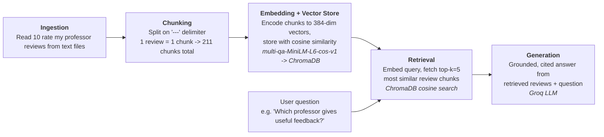

# Project 1 Planning: The Unofficial Guide

> Write this document before you write any pipeline code.
> Your spec and architecture diagram are what you'll use to direct AI tools (Claude, Copilot, etc.) to generate your implementation — the more specific they are, the more useful the generated code will be.
> Update the Retrieval Approach and Chunking Strategy sections if you change your approach during implementation.
> Update this file before starting any stretch features.

---

## Domain

<!-- What domain did you choose? Why is this knowledge valuable and hard to find through official channels? -->
The domain i chose is student reviews of professors at UCSD in the halıcıoğlu data science institute. This is knowledge is valuable because finding a teacher that suits your preferences or just finding out in general if a teacher is good or not is important for student success. It's usually hard to find this information because student experiences vary getting a general consensus is definitely helpful.

---

## Documents

<!-- List your specific sources: URLs, subreddit names, forum threads, or file descriptions.
     Aim for at least 10 sources that together cover different subtopics or perspectives within your domain. -->

| # | Source | Description | URL or location |
|---|--------|-------------|-----------------|
| 1 | Rate My Professors — Rose Yu | Student reviews of CSE/DSC professor Rose Yu (Computer Science), 7 reviews | `documents/rose_yu.txt` |
| 2 | Rate My Professors — Brad Voytek | Student reviews of professor Brad Voytek (Cognitive Science), 22 reviews | `documents/brad_voytek.txt` |
| 3 | Rate My Professors — Arun Kumar | Student reviews of professor Arun Kumar (Computer Science), 4 reviews | `documents/arun_kumar.txt` |
| 4 | Rate My Professors — Soohyun Liao | Student reviews of professor Soohyun Liao (Data Science), 55 reviews | `documents/soohyun_liao.txt` |
| 5 | Rate My Professors — Justin Eldridge | Student reviews of professor Justin Eldridge (Data Science), 27 reviews | `documents/justin_eldridge.txt` |
| 6 | Rate My Professors — Rajesh Gupta | Student reviews of professor Rajesh Gupta (Computer Science), 9 reviews | `documents/rajesh_gupta.txt` |
| 7 | Rate My Professors — Julian McAuley | Student reviews of professor Julian McAuley (Computer Science), 60 reviews | `documents/julian_mcauley.txt` |
| 8 | Rate My Professors — Gal Mishne | Student reviews of professor Gal Mishne (Computer Science), 5 reviews | `documents/gal_mishne.txt` |
| 9 | Rate My Professors — Jingbo Shang | Student reviews of professor Jingbo Shang (Data Science), 16 reviews | `documents/jingbo_shang.txt` |
| 10 | Rate My Professors — Vineet Bafna | Student reviews of professor Vineet Bafna (Computer Science), 6 reviews | `documents/vineet_bafna.txt` |

---

## Chunking Strategy

<!-- How will you split documents into chunks?
     State your chunk size (in tokens or characters), overlap size, and explain why those
     numbers fit the structure of your documents.
     A review-heavy corpus warrants different chunking than a long FAQ. -->
**Chunk size:** One review per chunk. Chunks are variable length the embedded text runs roughly 56–459 characters (~14–115 tokens).

**Overlap:** 0

**Reasoning:** The documents are delimited by `---` so separating by this delimiter will give exactly one review. Doing anything else could cut a single review in half or merge two different reviews into one chunk which would hurt the accuracy of the RAG system. For that same reason there is no overlap. Because each chunk is a single short review, every chunk fits comfortably inside the embedding model's 512-token window so nothing gets truncated.

**Final chunk count:** 211 (one chunk per review, across all 10 professor files).
---

## Retrieval Approach

<!-- Which embedding model are you using (e.g., all-MiniLM-L6-v2 via sentence-transformers)?
     How many chunks will you retrieve per query (top-k)?
     If you were deploying this for real users and cost wasn't a constraint, what tradeoffs
     would you weigh in choosing a different embedding model — context length, multilingual
     support, accuracy on domain-specific text, latency? -->

**Embedding model:** I chose `multi-qa-MiniLM-L6-cos-v1` (via `sentence-transformers`) over the general-purpose model `all-MiniLM-L6-v2` because it was trained specifically for short natural-language questions matched against passages which makes sense for my use case (a student asks "Which professor gives useful feedback?" against a corpus of reviews). It's also free because it runs locally on the CPU.

**Top-k:** 5 because each chunk is exactly one review. I shouldn't pick a singular review as the correct. Instead, I will use several so i can get a general consensus (e.g. "most students say X, though one disagrees"). Five reviews is a good baseline to start off and I will change accordingly based on the accuracy.

**Production tradeoff reflection:**
- **Accuracy on domain-specific text:** I'd use a higher-quality model (OpenAI `text-embedding-3-small`) if cost wasn't an issue or a larger local model (`all-mpnet-base-v2`, `bge-large-en-v1.5`) against my 5 eval questions. But since my corpus is pretty limited I don't think these options are necessary. Student reviews vary, so I'd check whether a bigger model retrieves better on that noisy phrasing.
- **Context length:** Not a factor here since each chunk is one short review well under any model's window.
- **Multilingual support:** None. If I expanded to international student forums or non English reviews, I'd switch to a multilingual model like `paraphrase-multilingual-MiniLM-L12-v2` or Cohere's multilingual embed.
- **Latency & cost:** With only 211 chunks, local inference is effective, so latency isn't a concern. In a production setting with thousands or hundreds of thousands of documents is when I would be concerned.

---

## Evaluation Plan

<!-- List your 5 test questions with their expected correct answers.
     Questions should be specific enough that you can judge whether the system's response
     is right or wrong. "What are good dining halls?" is too vague.
     "What do students say about wait times at [dining hall name] during lunch?" is testable. -->

| # | Question | Expected answer | Why retrieval was strong / weak |
|---|----------|-----------------|---------------------------------|
| 1 | Which professor gives the most useful feedback? | Justin Eldridge — multiple reviews tagged "Gives good feedback"; Rajesh Gupta also noted for answering questions after class. | **Moderate (dist ~0.41–0.46).** The "Gives good feedback" tag is embedded in the chunk text, so it matched directly, but "useful feedback" is a soft concept spread across many reviews, so scores are mid-range rather than tight. |
| 2 | Is Julian McAuley a tough grader? | Yes — widely described as a harsh grader who refuses to curve; many reviews tagged "Tough grader". | **Strong (dist ~0.22–0.27).** Both the professor name and the "Tough grader" tag live in the embedded text, so the query matched the *who* and the *what* at once — all 5 hits were McAuley, tightly clustered. |
| 3 | Which data science professor has the easiest classes? | Ambiguous in the corpus — McAuley's CSE158 is "supposed to be" easy but reviewers say he made it hard; no professor is clearly identified as easiest. | **Weak.** Retrieval matched "data science professor" + positive sentiment and returned all-Justin-Eldridge reviews praising him, but they describe him as *great*, not *easy*. The embedding barely captured the "easiest"/difficulty axis — difficulty is poorly represented in free-text prose. |
| 4 | Are Soohyun Liao's lectures helpful? | Mixed — opinions split: some call her lectures messy and unorganized, others call them amazing and caring. | **Strong (dist ~0.33–0.37).** The professor name anchored every hit to Soohyun Liao, and the returned set is genuinely mixed-sentiment — ideal for a consensus-style answer ("most say X, though some disagree"). |
| 5 | Which professor should I avoid? | Based on lowest ratings / most negative reviews: Julian McAuley (many 1.0 ratings) and Soohyun Liao both have strongly negative reviews. | **Weak / mixed.** It surfaced real negative reviews (Soohyun Liao "worst professor I've ever had"), but hits [1] and [3] were *positive* Gupta reviews. Embeddings capture topic (discussion of professor quality) far better than polarity, so "avoid"/negative queries pull positive and negative reviews alike. |

**What we're doing here and why.** Before building the generation stage, we ran these 5 questions through retrieval (`test_retrieval.py`) and scored each by cosine distance. The point is to separate retrieval quality from generation quality: if a final answer is wrong, we want to know whether the system retrieved the wrong reviews or retrieved the right reviews and then wrote a bad answer. Judging retrieval on its own tells us that. The "Why" column records the diagnosis for each query so the failures are traceable to a specific cause rather than a vague "it didn't work."

The pattern across the five is consistent: retrieval is strong when a query names an entity or a concept that lives in the embedded text (Q2 professor name + "Tough grader" tag; Q4 professor name) and weak when a query depends on an axis the prose doesn't encode well (difficulty (Q3) and sentiment polarity (Q5)). Those two weak cases is why in the generation stage: I will (1)pass each retrieved review to the LLM with its numeric rating and difficulty as supporting evidence, so the model can reason about the difficulty/polarity that the embedding missed; and (2) the grounding prompt instructs the model to report the consensus and the disagreement and to refuse when the reviews don't cover the question, so mixed or off target retrieval produces an honest answer instead of a confidently wrong one.

---

## Anticipated Challenges

<!-- What could go wrong? Name at least two specific risks with reasoning.
     Consider: noisy or inconsistent documents, missing source attribution, off-topic
     retrieval, chunks that split key information across boundaries. -->

1. **Superlative and comparative questions don't fit top-k retrieval.** Questions like "which professor gives the *most* useful feedback?" or "the *easiest* classes" require comparing all 10 professors, but top-k=5 only ever sees 5 reviews drawn from one or two professors.

2. **The corpus is small/uneven and partly stale.** Review counts range from 60 (McAuley) and 55 (Soohyun Liao) down to 4 (Arun Kumar) and 5 (Gal Mishne), so retrieval is biased toward heavily-reviewed professors and the thin ones yield weak, low-confidence consensus.

---

## Architecture

<!-- Draw a diagram of your pipeline showing the five stages:
     Document Ingestion → Chunking → Embedding + Vector Store → Retrieval → Generation
     Label each stage with the tool or library you're using.
     You can use ASCII art, a Mermaid diagram, or embed a sketch as an image.
     You'll use this diagram as context when prompting AI tools to implement each stage. -->

---

## AI Tool Plan

<!-- For each part of the pipeline below, describe:
     - Which AI tool you plan to use (Claude, Copilot, ChatGPT, etc.)
     - What you'll give it as input (which sections of this planning.md, which requirements)
     - What you expect it to produce
     - How you'll verify the output matches your spec

     "I'll use AI to help me code" is not a plan.
     "I'll give Claude my Chunking Strategy section and ask it to implement chunk_text()
     with my specified chunk size and overlap" is a plan. -->

**AI tool:** Claude (Claude Code)

**Milestone 3 — Ingestion and chunking:**
- **Input:** My **Documents** table (so it knows there are 10 .txt files in documents/, one per professor) and my Chunking Strategy section (split on the `---` delimiter, 1 review = 1 chunk, no overlap, ~211 chunks total). I'll ask it to implement two functions: load_documents() to read every .txt file in documents/, and chunk_text() to split each file's contents on `---`.
- **Expected Result:** A list of chunk objects where each chunk carries the review text plus metadata I'll need later for citation the source professor (derived from the filename, e.g. julian_mcauley.txt → "Julian McAuley") and the source filename. It should strip whitespace and and drop empty chunks(e.g. trailing `---` or blank reviews) so I don't embed garbage.
- **How I'll verify the output matches my spec:**
  1. Assert the total chunk count is 211 (matches my Chunking Strategy), and print a per-file count to confirm it lines up with the review counts in my Documents table (McAuley = 60, Soohyun Liao = 55, Arun Kumar = 4, etc.).
  2. Spot-check 3–4 random chunks to confirm each contains exactly one review (no merged or split reviews) and that the professor metadata is correct.
  3. Confirm no chunk is empty and none exceeds the 512-token window of `multi-qa-MiniLM-L6-cos-v1` (quick length check), so nothing gets truncated at embedding time.

**Milestone 4 — Embedding and retrieval:**
- **Input:** My Retrieval Approach section (embedding model `multi-qa-MiniLM-L6-cos-v1`, 384-dim, ChromaDB with cosine similarity, top-k=5) and the chunks.json produced in Milestone 3. I'll also give it the key design decision: embed only the natural language prose (professor name + tags + comment) and keep the structured fields (rating, difficulty, course, date, aggregate stats) as metadata that is stored alongside the vector but not embedded. I'll ask it to implement two scripts: embed.py to build the vector store and retrieve.py to query it.
- **Expected Result:**
  - embed.py loads chunks.json, encodes each chunk's text with `multi-qa-MiniLM-L6-cos-v1` (normalized embeddings, since it's a cosine model), and writes the vectors + documents + metadata into a persistent ChromaDB. Re-running it should rebuild the collection from scratch so it stays in sync with chunks.json.
  - retrieve.py loads the model + collection once (so generation can reuse it without reloading per query), embeds a query with the same model and normalization as indexing, and returns the top-5 chunks with their text, metadata, cosine distance, and a similarity = 1 - distance score.
- **How I'll verify the output matches my spec:**
  - Confirm embed.py stores exactly 211 vectors and reports embedding dimension 384 (matches my Retrieval Approach).
  - Check that the numeric fields stays out of the embedded text. Only professor + tags + comment should be in each chunk's text; rating/difficulty/date/course should appear only in metadata (this is the embedding-vs-metadata split, not a generation concern).
  - Run a retrieval-only sanity check (test_retrieval.py) on my 5 evaluation questions and read the returned chunks + distance scores. Verify that entity/concept queries cluster tightly (e.g. "Is Julian McAuley a tough grader?" returns all-McAuley hits at low distance) and record where retrieval is weak (difficulty and sentiment-polarity queries) in my Evaluation Plan so the failures are traceable to retrieval rather than generation.

**Milestone 5 — Generation and interface:**
- **Input:** My pipeline diagram (Retrieval → Generation), my Retrieval Approach section, and the Retriever from Milestone 4. I'll give the AI my explicit requirements: (1) the grounding rule answer only from the retrieved review chunks, never from the model's training knowledge, and say so when the reviews don't cover the question, (2) the output format a written answer plus a separate list of the sources it drew from, (3) the LLM choice Groq's `llama-3.3-70b-versatile`, and (4) the decision for retrieved review should be passed to the model with its numeric rating + difficulty + tags as supporting evidence (the prose stays the primary source), so the model can reason about the difficulty and sentiment that retrieval embeds poorly. I'll ask it to implement generate.py and app.py (a Gradio interface wired to it).
- **Expected Result:**
  - generate.py builds the prompt by formatting each retrieved chunk into a numbered block (cite as (Professor, Course, Date) + the rating/difficulty/tags line + the comment), sends it to Groq with a grounding rules rather than suggesting it.
  - app.py loads the model + collection once and starts up the Gradio Blocks UI. The source list is built programmatically from chunk metadata, not parsed out of the LLM's text, so attribution is guaranteed even if the model forgets to cite.
- **How I'll verify the output matches my spec:**
  - confirm the system prompt actually enforces grounding and that the source list is assembled in Python from metadata, not left to the LLM.
  - ask "could this answer have come from anywhere other than the retrieved chunks?" For a covered question (e.g. "Is Julian McAuley a tough grader?") every claim should trace to a cited review; for a question my corpus doesn't cover (e.g. "Which dining hall has the best food?") the system must say it doesn't have enough information instead of inventing a plausible answer from general knowledge.
  - Confirm the UI returns both the answer and the programmatic source list, and that the sources shown match the chunks actually retrieved (professor / course / date / similarity).
